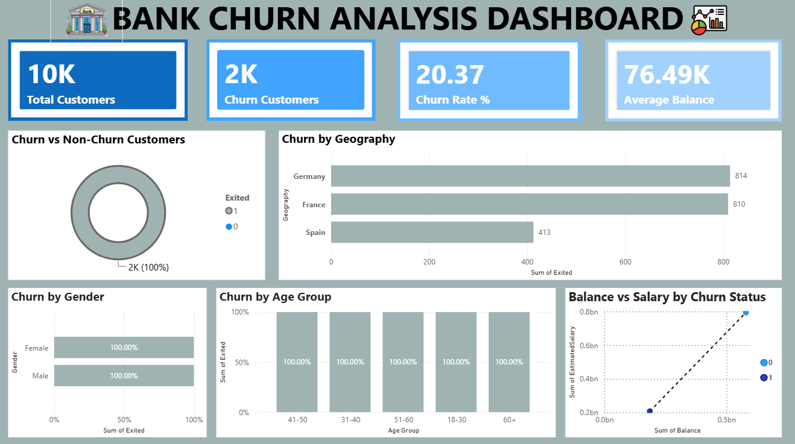
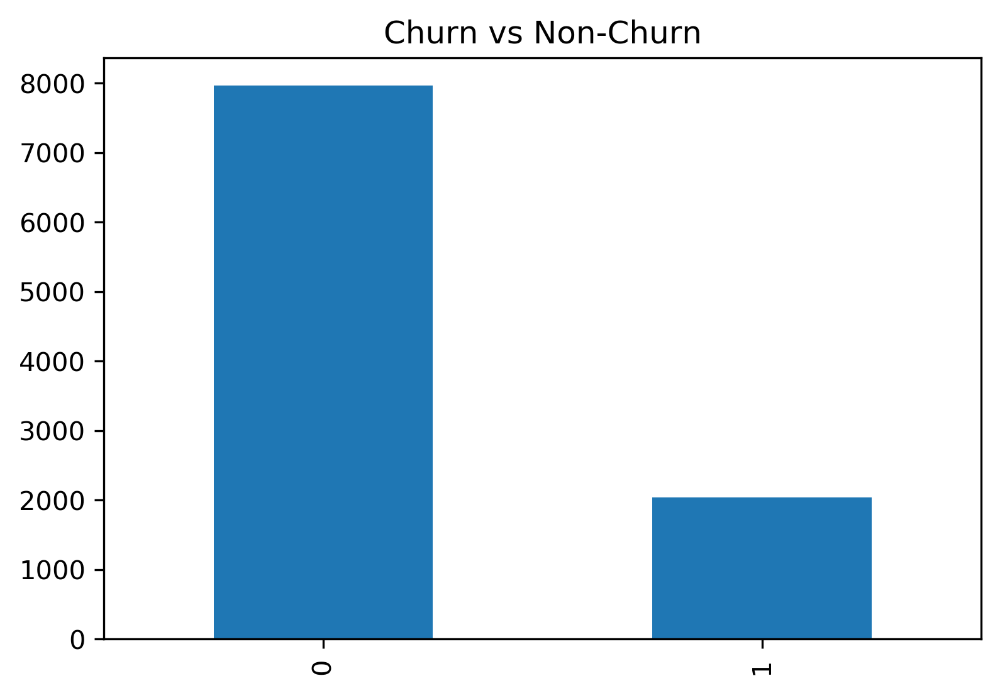
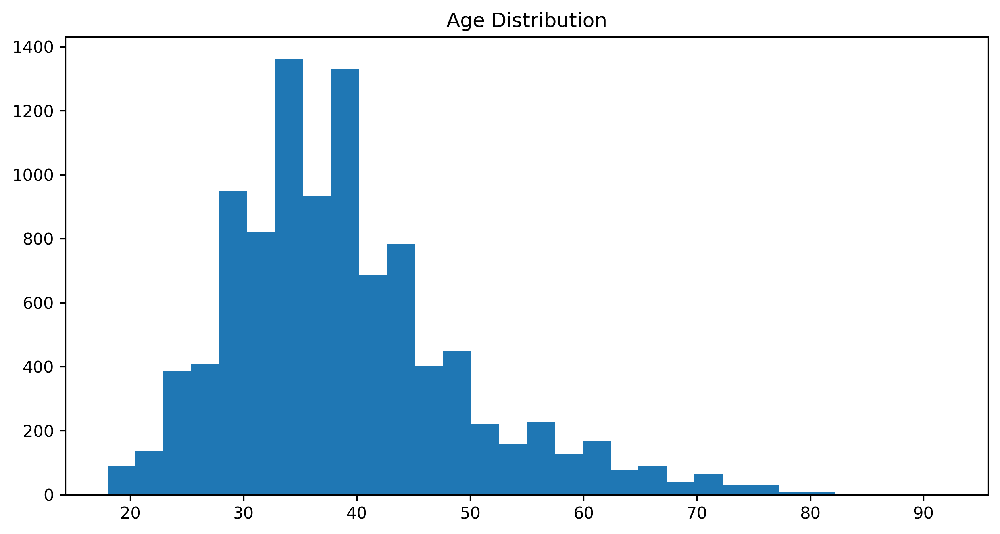
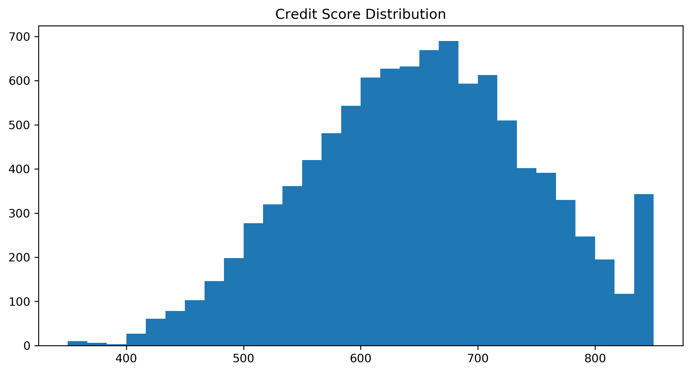
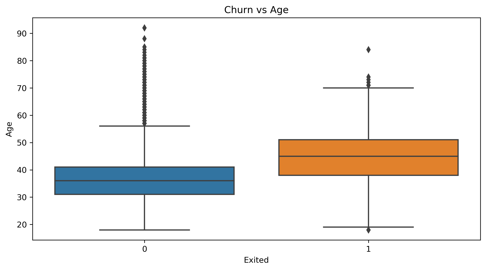
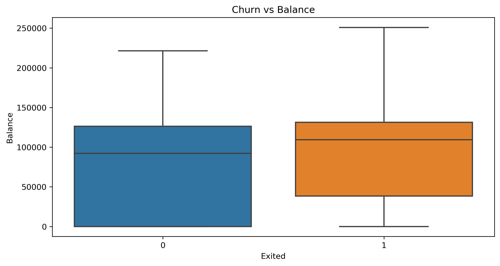
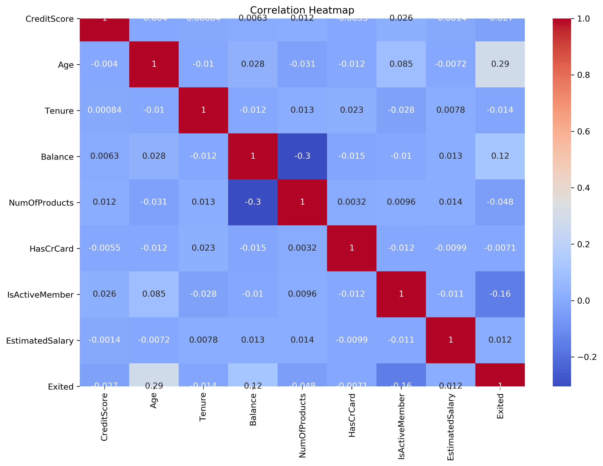

# Bank Customer Churn Analysis using SQL, Python & Power BI

## 📌 Project Overview

This project analyzes customer churn data from a banking dataset to identify the key factors that influence customer attrition. The analysis combines **SQL**, **Python**, and **Power BI** to perform data cleaning, exploratory data analysis (EDA), business analysis, and interactive dashboard creation.

---

## 🎯 Objective

The main objective of this project is to:

- Analyze customer churn patterns.
- Identify the factors influencing customer exit.
- Perform SQL-based business analysis.
- Create visualizations using Python.
- Build an interactive Power BI dashboard.
- Generate business insights for customer retention.

---

## 🛠️ Tools & Technologies

- Python
- SQL (MySQL)
- Power BI
- Pandas
- NumPy
- Matplotlib
- Seaborn
- Jupyter Notebook

---

## 📂 Dataset

- **Dataset:** Bank Customer Churn Dataset
- **Source:** Kaggle
- **Records:** 10,000
- **Features:** 14

---

## 📋 Project Workflow

1. Data Collection
2. Data Cleaning
3. Exploratory Data Analysis (EDA)
4. SQL Business Analysis
5. KPI Analysis
6. Dashboard Development
7. Business Insights

---

## 🧹 Data Cleaning

- Removed unnecessary columns:
  - RowNumber
  - CustomerId
  - Surname
- Checked for missing values
- Verified data consistency
- Validated numerical columns

---

## 🐍 Python Analysis

The following analyses were performed:

- Customer Churn Distribution
- Age Distribution
- Credit Score Distribution
- Balance Distribution
- Churn vs Age Analysis
- Churn vs Balance Analysis
- Correlation Heatmap

---

## 🗄️ SQL Analysis

The following SQL queries were executed:

- Total Customers
- Churn Customers
- Churn Rate
- Customers by Geography
- Customers by Gender
- Average Balance by Geography
- Active Members vs Churn
- Credit Card Holders vs Churn
- Average Credit Score
- Top 10 Highest Balance Customers

---

## 📊 Power BI Dashboard

The dashboard includes:

### KPI Cards

- Total Customers
- Churn Customers
- Churn Rate
- Average Balance

### Visualizations

- Churn vs Non-Churn
- Customer Churn by Geography
- Customer Churn by Gender
- Customer Churn by Age Group
- Balance vs Salary Analysis

---

## 📈 Business Insights

- Around **20%** of customers have exited the bank.
- Customers aged **40–60 years** show higher churn rates.
- Customers with higher account balances are more likely to churn.
- Inactive customers have significantly higher churn.
- Geography plays an important role in customer retention.
- Credit score has a relatively weak impact on churn.
- Customer engagement is a major factor in reducing churn.

---

## 📁 Project Structure

```
Bank_Churn_Analysis
│
├── data
│   └── churn.csv
│
├── notebooks
│   └── churn_analysis.ipynb
│
├── sql
│   └── churn_queries.sql
│
├── powerbi
│   └── Bank_Churn_Dashboard.pbix
│
├── visuals
│   ├── chart1.png
│   ├── chart2.png
│   ├── chart3.png
│   ├── chart4.png
│   ├── chart5.png
│   ├── chart6.png
│   └── dashboard_screenshot.png
│
├── requirements.txt
│
└── README.md
```

---

## 📸 Project Screenshots

### Python Visualizations

- Customer Churn Distribution
- Age Distribution
- Credit Score Distribution
- Balance Distribution
- Churn vs Age
- Correlation Heatmap

### Power BI Dashboard

(Add your dashboard screenshot here after uploading it to the repository.)

---

## 🚀 Future Improvements

- Machine Learning model for churn prediction
- Interactive Streamlit web application
- Customer segmentation
- Predictive analytics using classification algorithms

---
## 📊 Dashboard Preview



---

## 📈 Python Visualizations

### Churn Distribution



### Age Distribution



### Credit Score Distribution



### Churn vs Age



### Churn vs Balance



### Correlation Heatmap



## 👨‍💻 Author

**Murali Krishna**

Data Analyst Intern

---

## ⭐ If you found this project useful, consider giving it a star!
